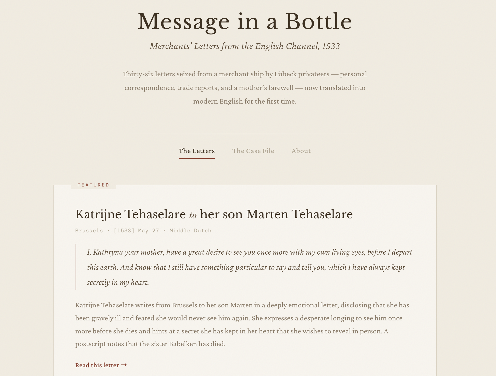

# Message in a Bottle

A digital edition of 36 merchants' letters intercepted in the English Channel in 1533, presented with modern English translations for the first time.

**Live site:** [messageinabottle.tomek-szymaniec.workers.dev](https://messageinabottle.tomek-szymaniec.workers.dev/)

In the summer of 1533, Lübeck privateers seized a merchant ship off the south coast of England. Among the cargo were private letters — business correspondence, family news, a dying mother's farewell — that had never reached their recipients. Confiscated as evidence and filed in the Lübeck city archives, they survived unread for nearly five centuries.

This project takes the scholarly transcriptions published in [*Message in a Bottle*](https://www.brepols.net/products/IS-9782503595405-1) (Jenks & Wubs-Mrozewicz, eds., 2022) and makes them accessible to a general audience through AI-generated modern English translations and a browsable web interface.



## What's included

- **36 merchants' letters** in Middle English, Middle Dutch, and Low German — with translations, summaries, and thematic tags
- **46 administrative documents** (depositions, inventories, quitclaims) documenting the legal aftermath of the seizure
- A static website presenting the collection with filtering, deep-linkable URLs, and side-by-side original/translation views

## Implementation

The data pipeline runs in four phases:

1. **PDF to Markdown** — `markitdown` library converts the source PDF
2. **Parse & structure** — Python script extracts individual letters and documents into JSON
3. **Translation & enrichment** — AI (Claude) generates modern English translations, summaries, and metadata tags
4. **Web presentation** — A build script bakes the JSON data into a single static HTML file

The website is a vanilla HTML/CSS/JS single-page app with no framework dependencies. The entire site ships as a single `index.html` file (~750KB) with all data embedded.

**Translations are AI-generated and not peer-reviewed.** They are provided for accessibility, not scholarly authority. For research, consult the original transcriptions and the published edition.

## Project structure

```
letters.json              # Structured data for 36 letters
documents.json            # Structured data for 46 admin documents
catalogued/               # Individual .md files per letter/document
dist/                     # Built website (deploy this)
  index.html
code/                     # All source code
  build.py                # Builds dist/index.html from template + JSON
  site/template.html      # HTML/CSS/JS template
  convert.py              # Phase 0: PDF → Markdown
  parse.py                # Phase 1: Markdown → JSON
  merge_translations.py   # Phase 2: Letter translations
  merge_doc_translations.py
  merge_enrichments.py    # Phase 3: Letter enrichment
  merge_doc_enrichments.py
  prototypes/             # Design prototypes
docs/plans/               # Design and implementation plans
```

## Running locally

Prerequisites: Python 3.10+

**Build the site:**

```bash
python code/build.py
```

**View it:**

```bash
open dist/index.html
```

Or serve it locally:

```bash
python -m http.server 8000 --directory dist
```

Then visit http://localhost:8000

## Deploying to Cloudflare Pages

### Via the Cloudflare dashboard

1. Push this repository to GitHub
2. Go to [Cloudflare Dashboard](https://dash.cloudflare.com/) → Workers & Pages → Create application → Pages
3. Connect your GitHub repository
4. Configure build settings:
   - **Build command:** `python code/build.py`
   - **Build output directory:** `dist`
5. Deploy

Cloudflare will rebuild automatically on every push to `main`.

### Via direct upload

1. Build locally: `python code/build.py`
2. In the Cloudflare dashboard, choose Pages → Create → Direct upload
3. Upload the `dist/` directory
4. Your site will be live at `<project-name>.pages.dev`

## Deep linking

Every letter and document has a permanent anchor link:

- `#letter/27` — Katrijne Tehaselare's farewell to her son
- `#doc/40` — Schedule of English merchants' losses
- `#about` — About the project

These work as URL fragments appended to your deployment URL (e.g. `https://yoursite.pages.dev/#letter/27`).

## Credits

Source material: *Message in a Bottle: Merchants' letters, merchants' marks and the English Channel, 1533* (Stuart Jenks & Justyna Wubs-Mrozewicz, eds., Brepols, 2022). Published open-access.

Translations and enrichment generated by Claude (Anthropic). Web presentation built with Claude Code.
